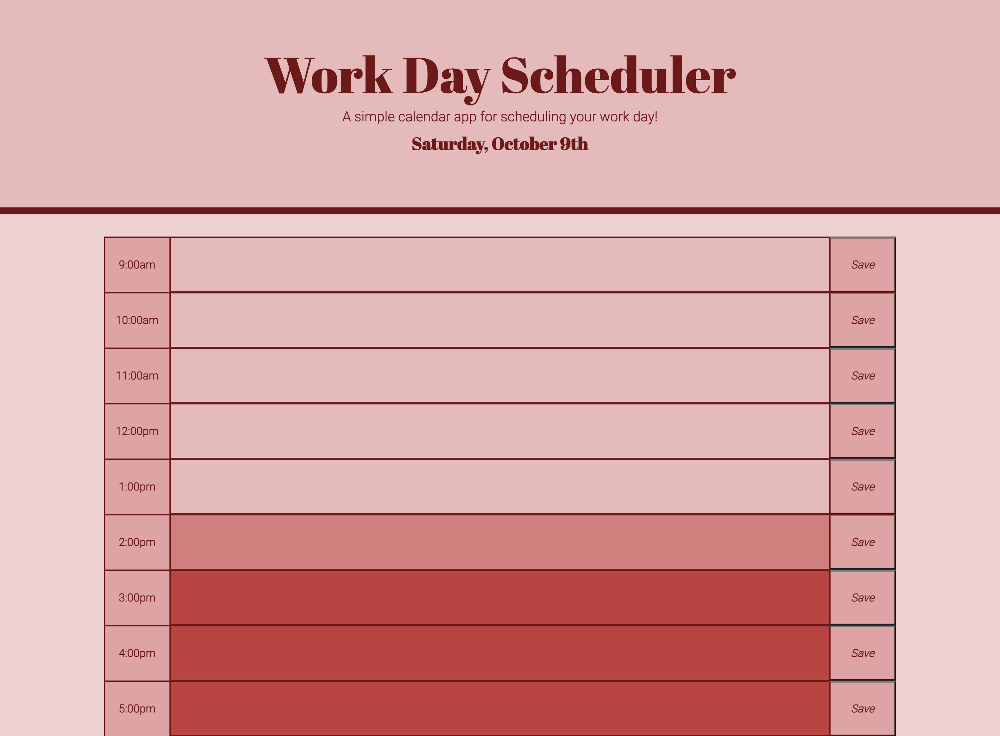

# WORK DAY SCHEDULER

## Description:
A planner is a great way to keep track of our very busy schedules! 
This week, I was tasked with modifying some starter code to create a work day schedule app that will run in a browser and feature dynamically updated HTML and CSS using jQuery as well as moment.js for date/time.

## User Story:
```md
AS AN employee with a busy schedule
I WANT to add important events to a daily planner
SO THAT I can manage my time effectively
```

## Criteria:
```md
GIVEN I am using a daily planner to create a schedule
WHEN I open the planner
THEN the current day is displayed at the top of the calendar
WHEN I scroll down
THEN I am presented with timeblocks for standard business hours
WHEN I view the timeblocks for that day
THEN each timeblock is color coded to indicate whether it is in the past, present, or future
WHEN I click into a timeblock
THEN I can enter an event
WHEN I click the save button for that timeblock
THEN the text for that event is saved in local storage
WHEN I refresh the page
THEN the saved events persist
```

## My scheduler mockup:
I chose to stick with a retro style red/pink color scheme for my scheduler to make it pop for the user.

css color codes from left to right: #6d1919, #b94543, #d07f7e, #dea5a4, #e6baba, #eed2d2.

      


Below is my final work day scheduler:


* When opened in a browser, it will update the day and date so it is always current. 

* The time-blocks for the scheduler go from 9am to 5pm (a typical work day), but can be updated to fit anyone's work schedule. 

* each timeblock is color coded to show time of day as being in the past, present or future, to make it easier on the user.

* the user can input an event into the scheduler row and once they press save, their event is saved (even upon refresh) until they override it with another event.


